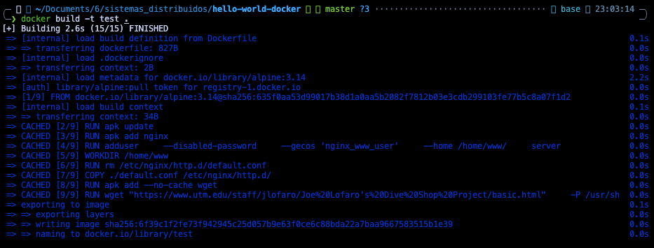
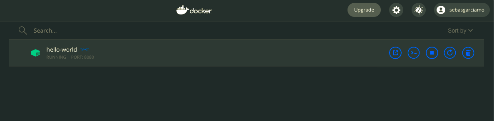

# Mini-hello world with Docker

## Usage 
```
git clone https://github.com/SebasGarcia08/hello-world-docker
cd hello-world-docker
# Builds Docker image
# -t: tag of the image
# .: look Dockerfile in current folder
docker build -t test .
# Run container 
# -it: instructs Docker to allocate a pseudo-TTY connected to the container's stdin; creating an interactive bash shell in the container.
# -p 127.0.0.1:8080:80/tcp: map port 80 on container to 8080 in host machine.
# --name hello-world: name of the container 
# test: tag of the Docker image
docker run -it -p 127.0.0.1:8080:80/tcp --name hello-world test
```

# Evidences

## Build


## Run
After running ```docker run ...```, in the app can be noticed:



And when we access the localhost at the mapped port (8080), we see the Simplest Website in the World.


# CMD vs ENTRYPOINT

In a nutshell, when the CMD instruction is used, the specified command is **replaced enirely** by the argument command used to run the docker container. However, when the ENTRYPOINT instruction is used, the specified command is prepended to the argument command used to run the docker container. For example:


Using ```CMD```, the ```Dockerfile``` looks as follows:

```
FROM ubuntu:latest
CMD ["sleep", "5"] # Default command, fixed to 5 seconds
```

Using ```ENTRYPOINT```, the ```Dockerfile``` looks as follows:

```
FROM ubuntu:latest
ENTRYPOINT ["sleep"] # Specifies the command, but not fixed arguments
```

we can build both Dockerfiles with:

```
docker build -t ubuntu-sleeper .
```

Now, we want to run a container with the ubuntu-sleeper image to wait any number of seconds.

With ```CMD``` we might have to run:

```
docker run ubuntu-sleeper sleep 10
```

With ```ENTRYPOINT``` we might have to run:

```
docker run ubuntu-sleeper 10
```

In general, CMD is suitable to use if we need a default command which users can easily override. If a Dockerfile has multiple CMDs, it only applies the instructions from the last one. On the other hand, ENTRYPOINT is preferred when we want to define a container with a specific executable that users can specify different arguments for.
