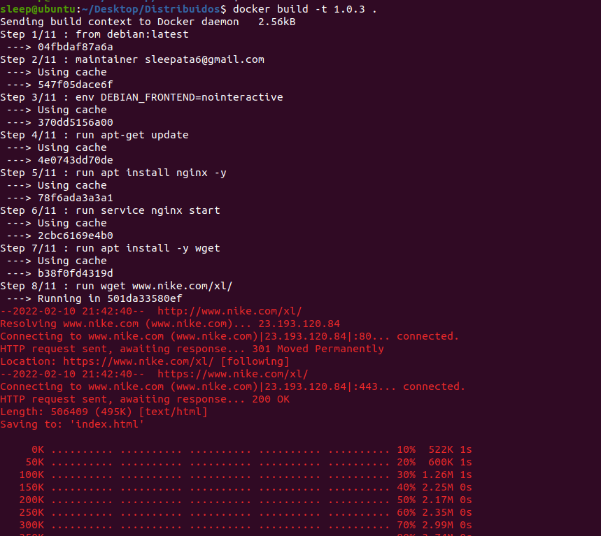
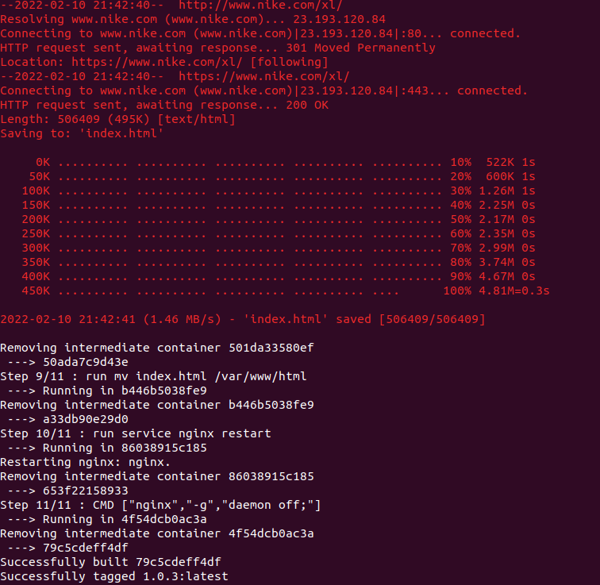
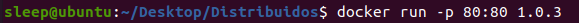

CESAR CANALES A00345026
# Diferencia entre CMD y ENTRYPOINT

Con CMD y ENTRYPOINT es posible especificar comandos a ejecutar en un contenedor de docker. La diferencia radica en que es posible hacerle override al CMD de manera sencilla mientras que hacerle override al ENTRYPOINT implica utilizar la directiva --entrypoint por lo que no es tan sencillo.

Esto quiere decir que al correr un contenedor que contiene las directivas de CMD y ENTRYPOINT con un parametro como "hostname", solo se ejecutarán las directivas de ENTRYPOINT mas no las de CMD.

Es bastante común combinar las directivas de CMD y ENTRYPOINT para hacer instrucciones que se ejecutan (ENTRYPOINT) con parametros variables (CMD).

# Web Scraping Dockerfile

Se hizo un Dockerfile capaz de hacerle web scraping a la página web de nike. Se utilizó la última imagen de Debian para hacer esto y el Dockerfile quedó almacenado en el repositorio.
A continuación, se muestra el funcionamiento del contenedor:

### Build:

### Run:

### Web scraping:

