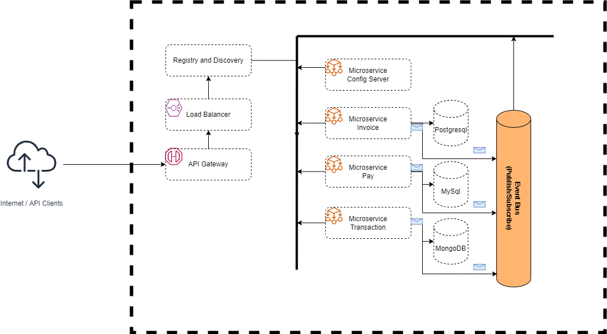

# Microservicios con Spring Boot

## Información de los microservicios
El microservicio de invoices, debe listar las facturas de clientes y además debe consumir una cola para cambiar el estado de la factura cuando esta se paga a través del microservicio de pago.
El microservicio de pago debe registrar el pago en su respectiva bd y además debe dejar un mensaje en una cola para actualizar la factura en el microservicio de facturas y además debe dejar un mensaje en una cola para registrar el movimiento en el microservicio de transacciones.
El microservicio de transacciones debe listar las transacciones de una factura, además debe consumir una cola para obtener las transacciones de pago del microservicio de pago.
Todos los microservicios deben consumir la cadena de conexión desde el servicio de configuración centralizada.

La información de los endpoints disponibles por microservicio se incluyen en el documento de INFO.md
## Scripts de creación de bases de datos

La informacion de como crear las bases de datos y sus respectivas tablas se incluyen en google.com

## Tecnologías utilizadas

- Spring Boot (Java Framework JDK v11+)
- Gradle (Gestor de dependencias)
- Postman (Test de endpoints/servicios rest)
- Postgresql (Base de Datos)
- MySQL (Base de Datos)
- MongoDB (Base de Datos NoSQL)
- Kafka (Gestor de Mensajería)
- Github (Repositorio para proyecto y Configuraciones de micorservicios)

# SD-WORKSHOP-1

First of all, we must make a Fork to the base repository and clone it in our computer. 

## APP-CONFIG
 
Once cloned we must enter the address where we find the app-config folder, in which we must continue with the following steps:
- We change inside the Dockerfile the port used by 8888.
- In the build.gradle file we comment the Consul dependency.
- Inside the resources address, we comment the Consul lines.

Then we proceed to create a network by the name of distributed, as shown in the following image: 

Now we build the app-config:0.0.1 image:
 
 

Finally we run the created image with the created network:

 
Test run

We upload the changes made to the DockerHub.

 
## APP-INVOICE 
In order to run the app-invoice we must run the PostgresSQL and Kafka images as follows.

 

 

 
Now, entering the Dockerfile of the app-invoice, we change the port to 8006.

 
Then we can build the image just like with app-config:

 

 
We run the app-invoice:

Now, we insert to postgres db_invoice in the table invoice the data.

Testing:

Finally we upload the changes
 

