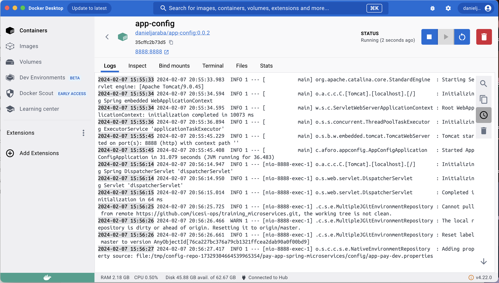
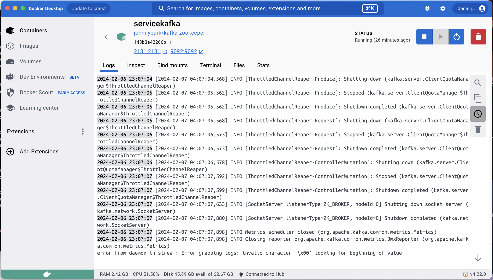
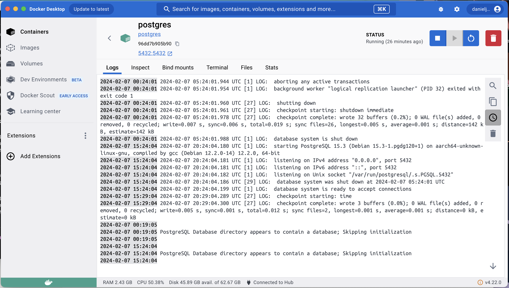
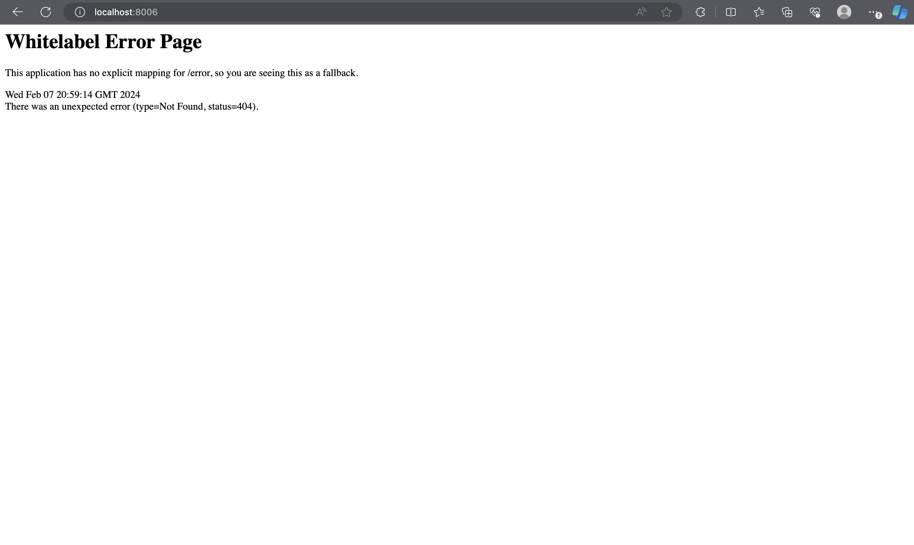
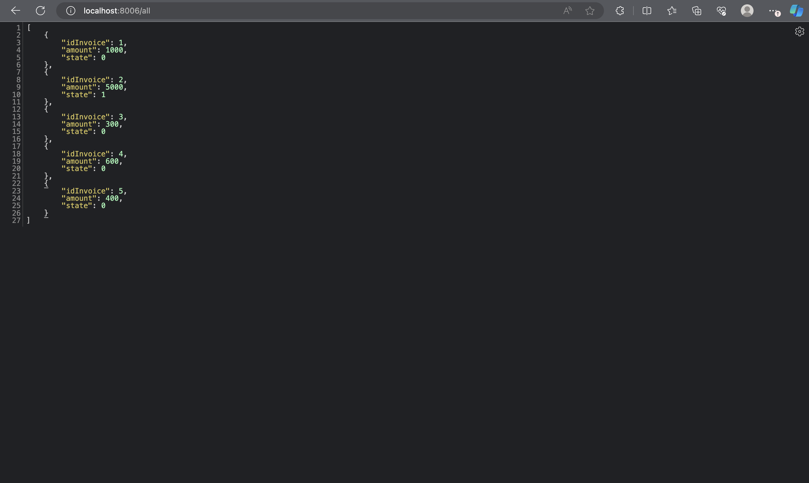

# sd-workshop1 2024-A
Presented by: Daniel Jaraba

The following are the steps executed to succesfully ran the microservice app-invoice from the repository [pay-app-microservices](https://github.com/icesi-ops/training_microservices/blob/master/pay-app-spring-microservices):

## 1. Run microservice app-config:
  1. Edit Dockerfile to match the application.properties file.
  ```
  EXPOSE 8888 # Changed from 8010
  ```
  2. Edit application.properties file to make comment the lines of the consul service configuration properties.
  ```
  # Consul
  #spring.cloud.consul.host=consul
  #spring.cloud.consul.port=8500
  #spring.cloud.consul.discovery.health-check-interval=5s
  #spring.cloud.consul.discovery.prefer-ip-address=true
  ```
  3. Edit build.gradle to comment the consul service dependency.
  ```
  #implementation 'org.springframework.cloud:spring-cloud-starter-consul-discovery'
  ```
  4. Create a docker network for the microservices.
  ```
  docker network create distribuidos
  ```
  5. Build the docker image using the Dockerfile and push it to Docker Hub ([result](https://hub.docker.com/repository/docker/danieljaraba/app-config/general)).
  ```
  docker build -t [repository]/app-config:0.0.1 . # Use --platform=linux/amd64 in case of failures
  ```
  6. Run the microservice app-config and add it to the network.
  ```
  docker run -p 8888:8888 --name app-config --network distribuidos [repository]/app-config:0.0.1
  ```
  ### Proof:
  


## 2. Run Kafka service:
  1. Use the docker run command to pull the image and run it.
  ```
  docker run -p 2181:2181 -d -p 9092:9092 --name servicekafka --network distribuidos -e ADVERTISED_HOST=servicekafka -e NUM_PARTITIONS=3 johnnypark/kafka-zookeeper
  ```
  ### Proof:
  


## 3. Run PostgresQL database:
  1. Use the docker run command to pull the image and run it.
  ```
  docker run -p 5432:5432 --name postgres --network distribuidos -e POSTGRES_PASSWORD=postgres -e POSTGRES_DB=db_invoice -d postgres
  ```
  
  2. Run the database tables initialization for Postgres found in resources folder (disclaimer: you should have [psql](https://www.timescale.com/blog/how-to-install-psql-on-mac-ubuntu-debian-windows/) installed in your OS):
  ```
  psql -h localhost -d db_invoice -U postgres -f postgres.sql
  psql -h localhost -d db_invoice -U postgres -f data.sql
  ```


## 4. Run microservice app-invoice:
  1. Edit the Dockerfile to match the exposed port and the application.properties file pulled from the configuration server.
  ```
  EXPOSE 8006 # Changed from 8010
  ```
  2. Build the docker image using the Dockerfile and push it to Docker Hub ([result](https://hub.docker.com/repository/docker/danieljaraba/app-invoice/general)).
  ```
  docker build -t [repository]/app-invoice:0.0.1 . # Use --platform=linux/amd64 in case of failures
  ```
  3. Run the docker image and add it to the docker  network.
  ```
  docker run -d -p 8006:8006 --network distribuidos --name app-invoice icesiops/app-invoice:0.0.1
  ```
  
  
  
