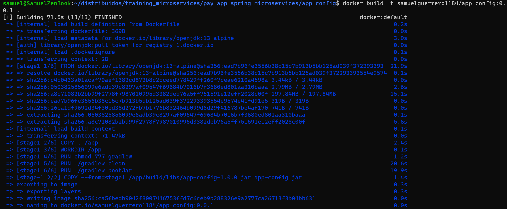

# sd-workshop1 2024-A
- By : Samuel Guerrero

## 1. Run microservice app-config:
1. Edit Dockerfile so it matches the applications.properties file, so we change the port so it matches to 8888
2. In the application.properties file we comment the consul service configuration, because it has no use at the moment.
```
#Consul
#spring.cloud.consul.host=consul
#spring.cloud.consul.port=8500
#spring.cloud.consul.discovery.health-check-interval=5s
#spring.cloud.consul.discovery.prefer-ip-address=true
```
4. Comment consul dependency at build.gradle
```
#implementation 'org.springframework.cloud:spring-cloud-starter-consul-discovery'
```
6. Create docker network
```
docker network create distribuidos
```
 
5. Build the app-config microservice
```
docker build -t samuelguerrero1184/app-config:0.0.1 .
```

6. After builiding the app-config, we run it
```
docker run -p 8888:8888 --name app-config -d --network distribuidos samuelguerrero1184/app-config:0.0.1
```

## 2. Run kafka service
1. Use docker command to pull image, build and run it
```
docker run -p 2181:2181 -d -p 9092:9092 --name servicekafka --network distribuidos -e ADVERTISED_HOST=servicekafka -e NUM_PARTITIONS=3 johnnypark/kafka-zookeeper
```

## 3. Run postgres database
1. Use docker command to pull image, build and run it
```
docker run -p 5432:5432 --name postgres --network distribuidos -e POSTGRES_PASSWORD=postgres -e POSTGRES_DB=db_invoice -d postgres
```

## 4. Run microservice app-invoice
1. Edit dockerfile to match port in application.properties file with port 8006
2. Build the app-invoice microservice 
```
docker build -t samuelguerrero1184/app-invoice:0.0.1 .
```

3. Run the app-invoice microservice in the known network
```
docker run -d -p 8006:8006 --network distribuidos --name samuelguerrero1184/app-invoice:0.0.1
```


## Evidence


